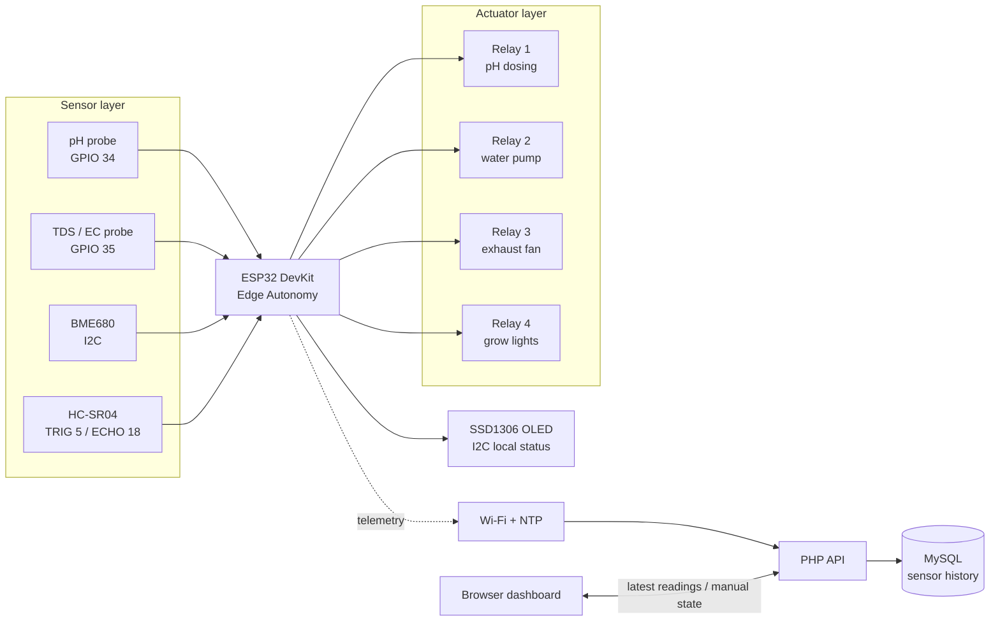
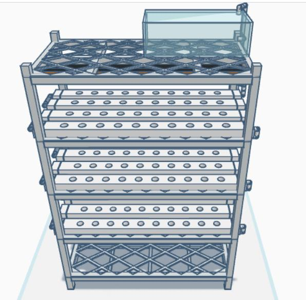
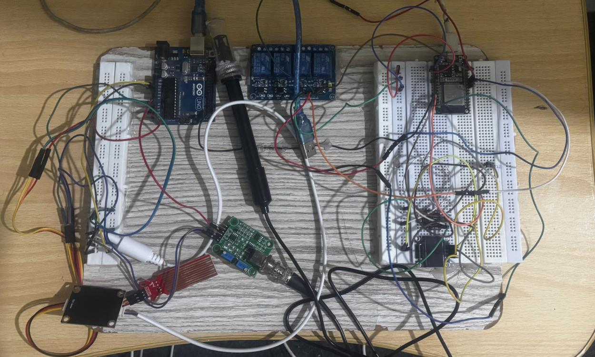
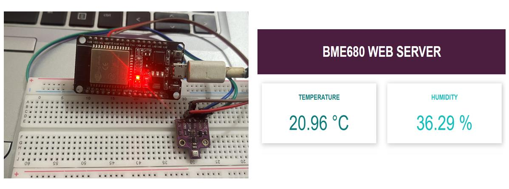
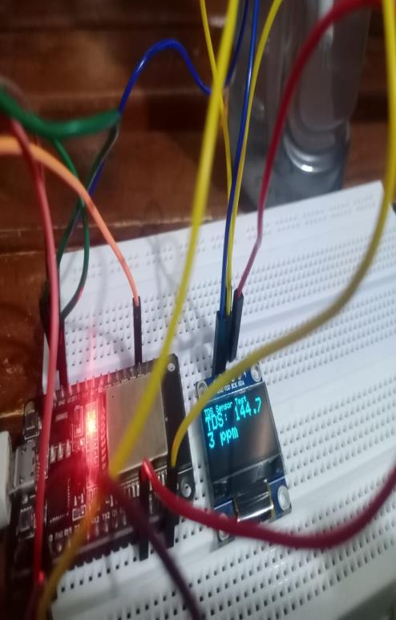
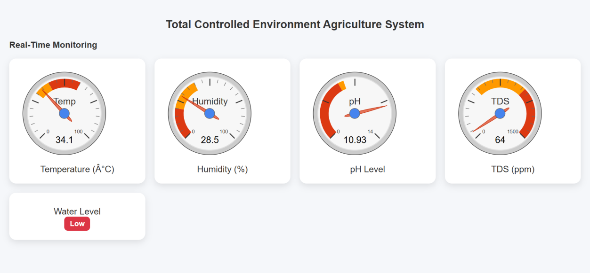
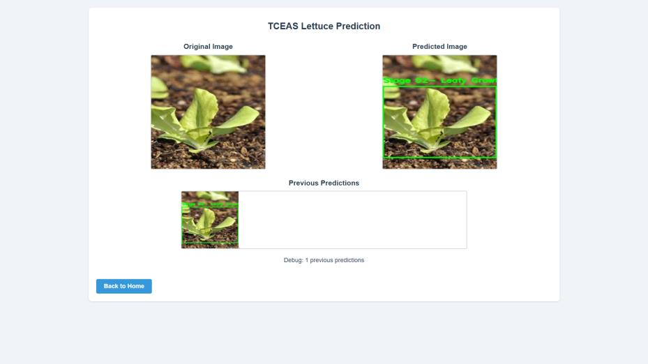
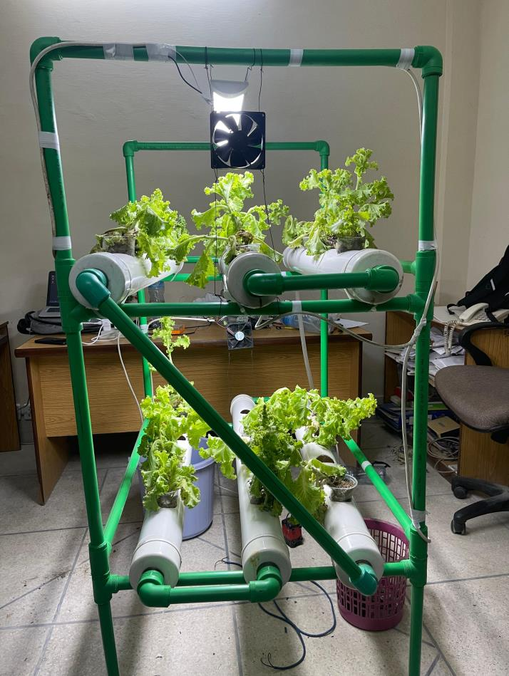

# HydroNexus Automated IoT NFT Hydroponic System

HydroNexus is a modular, edge-autonomous Nutrient Film Technique (NFT) hydroponic system for lettuce. The ESP32 reads environmental, nutrient, and water-level sensors; controls pumps, a fan, and grow lights; updates a local OLED; and optionally publishes telemetry to a PHP/MySQL dashboard.

> **Safety first:** This is an educational and lab starter repository. Keep mains wiring enclosed, use appropriately rated fuses and relays, separate low-voltage logic from pump/light wiring, and have a qualified adult review any installation that switches mains voltage.

## Repository structure

```text
firmware/
  config.h             Central pin map, thresholds, calibration, timing, Wi-Fi/NTP
  sensors.h/.cpp       pH, TDS/EC, BME680, and ultrasonic sensor subsystem
  actuators.h/.cpp     Edge safety, relays, fan, dosing, pump, and light schedule
  oled_display.h/.cpp  SSD1306 local status UI
  network.h/.cpp       Wi-Fi reconnect, NTP, and JSON telemetry
  main.ino             Small non-blocking application entry point
hardware/
  pinout_mapping.md    Wiring, voltage domains, divider, grounding, and power
  calibration_guide.md pH, TDS/EC, and water-level calibration procedures
  bill_of_materials.md Component list with supply and sizing notes
dashboard/
  index.html           Standalone browser dashboard with live gauges and toggles
  style.css            Dashboard visual styling
  api.php              JSON ingestion and latest-reading API
database/schema.sql     MySQL/MariaDB schema
ml/predict.py           PyTorch/OpenCV lettuce growth-stage classifier
```

## System block diagram



## Edge Autonomy architecture

The ESP32 makes all safety-critical decisions locally. Sensor sampling, dry-run protection, fan hysteresis, grow-light scheduling, and timed dosing continue even if Wi-Fi, the PHP server, or the database is unavailable. The network module is only a telemetry and clock service; it is never required for the water pump cutoff or temperature response.

The local safety rules are:

- **Dry-run protection:** if the ultrasonic level is below `MINIMUM_SAFE_WATER_LEVEL_PERCENT`, or the echo becomes invalid, the water pump is forced off.
- **Temperature control:** the exhaust fan turns on above 35°C and remains on until temperature falls below 33°C.
- **pH band:** the starter pH dosing routine pulses the pH-up pump below 5.5, then waits through a mixing lockout before dosing again.
- **Lighting:** grow lights follow the NTP-based schedule in `config.h`, with a local daytime fallback if NTP is unavailable.
- **Cloud failure:** readings continue locally and are posted only when Wi-Fi is connected.

## Hardware wiring

| Module | ESP32 connection | Supply / signal | Notes |
|---|---:|---|---|
| Analog pH sensor | GPIO 34 | 3.3 V-safe analog output | ADC input only; calibrate with pH 4.01 and 7.00 buffers. |
| Analog TDS sensor | GPIO 35 | 3.3 V-safe analog output | ADC input only; calibrate with a known reference solution. |
| BME680 | I²C GPIO 21 SDA / GPIO 22 SCL | 3.3 V | The firmware tries addresses `0x76` and `0x77`. |
| OLED SSD1306 | I²C GPIO 21 SDA / GPIO 22 SCL | 3.3 V | Typical address `0x3C`. |
| HC-SR04 TRIG | GPIO 5 | 5 V module input | 3.3 V ESP32 output is commonly accepted. |
| HC-SR04 ECHO | GPIO 18 | 5 V module output | **Use a resistor divider or level shifter.** |
| Relay 1 | GPIO 16 | 5 V relay logic | pH dosing pump. |
| Relay 2 | GPIO 17 | 5 V relay logic | Water circulation/refill pump. |
| Relay 3 | GPIO 19 | 5 V relay logic | Exhaust fan. |
| Relay 4 | GPIO 23 | 5 V relay logic | LED grow lights. |

See [`hardware/pinout_mapping.md`](hardware/pinout_mapping.md) for the full voltage, power, grounding, and relay-load notes.

## Hardware safety precautions

Use a **5 V regulated adapter** for the ESP32 and logic modules, and a separately fused **12 V supply** sized for all pumps and the fan. Use an optocoupled relay board with transistor drivers and contacts rated above the load's startup current. Do not power pumps from the ESP32 regulator.

The HC-SR04 ECHO line is typically 5 V and must be reduced before GPIO 18. A simple 1 kΩ series / 2 kΩ ground divider is documented in the pinout guide. Keep analog sensor lines away from pump and relay wires, add local decoupling capacitors, and use waterproof enclosures and cable glands around the grow area.

## Flash the modular firmware

1. Install Arduino IDE and the ESP32 board package.
2. Install `Adafruit BME680`, `Adafruit SSD1306`, `Adafruit GFX Library`, and `ArduinoJson`.
3. Open `firmware/main.ino`; Arduino will compile the adjacent `.h` and `.cpp` files as one sketch.
4. Replace `WIFI_SSID`, `WIFI_PASSWORD`, and `API_URL` in `firmware/config.h` locally. Do not commit real credentials.
5. Select the ESP32 board and port, upload, and open Serial Monitor at `115200` baud.
6. Verify sensor readings with relays disconnected before attaching pumps or lights.

The relay implementation assumes an active-LOW module. If your module is active-HIGH, swap `RELAY_ON_LEVEL` and `RELAY_OFF_LEVEL` in `config.h`.

## Calibrate before automation

Follow [`hardware/calibration_guide.md`](hardware/calibration_guide.md) before relying on dosing. The starter pH and TDS formulas are intentionally visible and easy to tune, but they are not universal to every probe/interface board. Measure and update tank distances in `config.h` as well.

## PHP dashboard and database

You need PHP 8+ with PDO MySQL and MySQL 8+ or MariaDB.

```bash
mysql -u root -p < database/schema.sql

export HYDRO_DB_HOST=127.0.0.1
export HYDRO_DB_NAME=hydronexus
export HYDRO_DB_USER=hydronexus_user
export HYDRO_DB_PASS='replace-with-a-long-password'

cd dashboard
php -S 0.0.0.0:8080
```

Open `http://localhost:8080/index.html`. The dashboard polls `api.php?action=latest` every five seconds. The ESP32 posts JSON readings with `type: "reading"` to the same API. Manual relay updates use `type: "relay"`; add device authentication and a command acknowledgement queue before exposing remote control outside a trusted lab network.

### Test with curl

```bash
curl -X POST http://localhost:8080/api.php \\
  -H 'Content-Type: application/json' \\
  -d '{
    "type":"reading",
    "device_id":"hydronexus-esp32-01",
    "temperature":24.8,
    "humidity":61,
    "pressure":1012.4,
    "gas_resistance":12.2,
    "ph":6.2,
    "tds":842,
    "water_level":78,
    "fan_on":false,
    "water_pump_on":true
  }'

curl 'http://localhost:8080/api.php?action=latest'
```

## Lettuce growth-stage classifier

```bash
python3 -m venv .venv
source .venv/bin/activate
pip install opencv-python numpy torch torchvision
python ml/predict.py --image ./samples/lettuce.jpg --json
```

If `models/lettuce_stage.pt` is present, the script loads the PyTorch/TorchScript checkpoint and expects three scores in the order `seedling`, `vegetative`, `mature`. If no checkpoint is available, it runs a documented OpenCV heuristic so the input/output pipeline can be tested before model training.

## Project evidence gallery

The following visuals are selected from the authors' FYP thesis report, **Automated Monitoring and Regulating IoT NFT Hydroponic System** (University of Engineering and Technology, Taxila, 2024). They document the design, electronics prototype, dashboard, ML output, and final physical system.

### NFT structure and electronics

| 3D NFT design | Integrated electronics prototype |
|---|---|
|  |  |

### Sensor and dashboard evidence

| BME680 sensor test | TDS and OLED test |
|---|---|
|  |  |



### ML result and final system

| Lettuce growth-stage prediction | Physical multi-tier NFT setup |
|---|---|
|  |  |

More detail and asset provenance are available in [`docs/figures/README.md`](docs/figures/README.md).

## Suggested production hardening

Add an API token per device, a server-side manual-command queue with acknowledgements, a maximum daily dose, and a post-dose mixing delay. Add historical charts and alerts to the dashboard. Train and validate the classifier on images from the same camera and lighting conditions used by the grow room.

## License

Add a license appropriate for your class, lab, or GitHub repository before publishing this project publicly.
